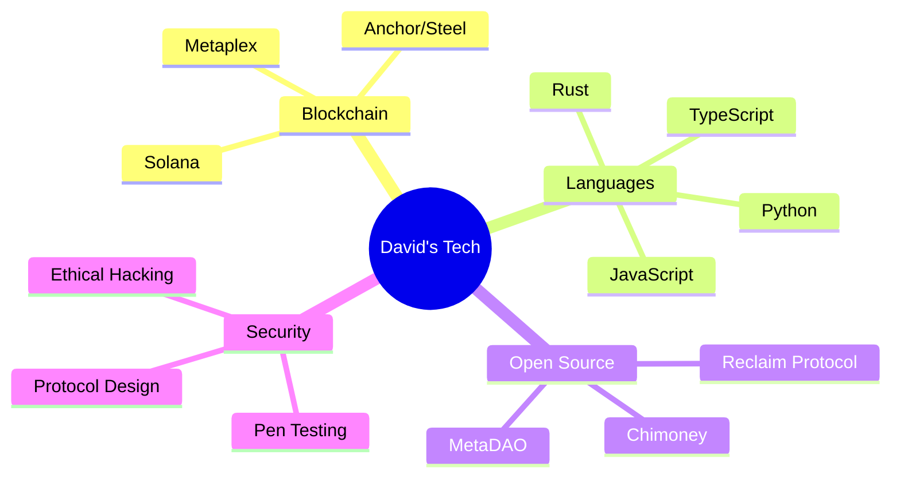

## Because ASCII art is the original meme that needs no compiling.
```ascii-art
 _____           __ __           \  /
/  ___\         /  V  \           \/
/  /   /        /   _   \          /  \
/  /   /       /  / \   \         /    \
/  /___/      /__/   \___\           
\____  /                                      
     \/                                      
```

<div align="center">


[](https://git.io/typing-svg)

</div>

## 🌌 TRANSMISSION INCOMING... 

> **`STATUS: DECRYPTING PROFILE...`**
> 
> **`NAME: DAVID`**
> 
> **`CLEARANCE: LEVEL INFINITY`**

<div align="center">


[](https://git.io/streak-stats)

</div>

## 🧬 TECH DNA SEQUENCE



## 🎮 SKILL MATRIX 
### SOURCE: TRUST ME BRO
<!-- Custom skill bars with gaming-style progress -->
```
Rust          [█████████░] 90%  // Main weapon of choice
TypeScript    [████████░░] 80%  // Trusty sidearm
Python        [███████░░░] 70%  // Utility belt
Solana        [████████░░] 80%  // Preferred battleground
Security      [████████░░] 80%  // Shield generator
```

## 🌍 GLOBAL IMPACT METRICS
<!-- Wakatime stats -->
<div align="center">

**My Code Odyssey with WakaTime:** **If it didn't display, then my stats must have broken their server**

[](https://wakatime.com/@davejne)

</div>

<div align="center">

[](https://github.com/anuraghazra/github-readme-stats)

</div>

## 🎯 CURRENT SIDE QUESTS

```diff
+ Contributing to open source
! Taking up a consistency challenge
- Writing more documentation
# Working on a product
```

## 🌟 ACHIEVEMENTS UNLOCKED

- 🏆 Deployed 10+ Smart Contracts 
- 🎮 Fixed a dependency issue for rust crate
- 🚀 Optimized an open source project built on Solana and performed benchmark tests using criterion
- 💻 Extending an AI functionalities.

## 🔮 ARTICLES
<!-- Blog posts -->
[](https://medium.com/@davidjrn247)

## 🌐 FIND ME SOMEWHERE ELSE

<div align="center">

[](https://twitter.com/heisdave7)
[](https://ng.linkedin.com/in/david-n-9356a5232)
[](https://medium.com/@davidjrn247)

</div>

</div>

---
## ALL MY BALLON D'OR
<div align="center">
  
[](https://github.com/ryo-ma/github-profile-trophy)

</div>

## A LITTLE BIT OF ASPIRE TO INSPIRE
> "In a world of 1s and 0s, be the 2."
