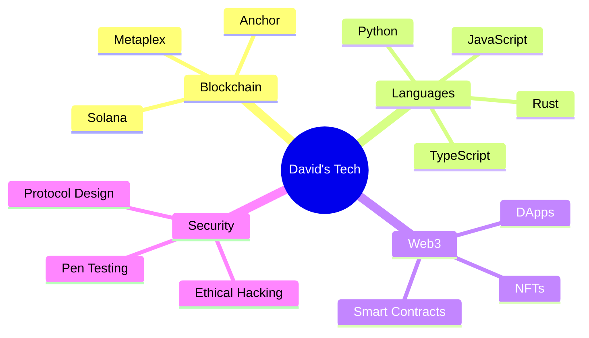

```ascii-art
     ╭━━━╮╱╱╱╱╱╱╱╱╱╱╭━━━╮
     ┃╭━╮┃╱╱╱╱╱╱╱╱╱╱┃╭━━╯
     ┃┃╱┃┣━━┳╮╭┳┳━╮╱┃╰━━╮
     ┃╰━╯┃╭╮┃╰╯┣┫╭╮╮┃╭━━╯
     ┃╭━╮┃╰╯┃┃┃┃┃┃┃┃┃┃
     ╰╯╱╰┻━━┻┻┻┻┻╯╰╯╰╯
```

<div align="center">


[](https://git.io/typing-svg)

</div>

## 🌌 TRANSMISSION INCOMING... 

> **`STATUS: DECRYPTING NEURAL PROFILE...`**
> 
> **`SUBJECT: DAVID`**
> 
> **`CLEARANCE: LEVEL INFINITY`**

<div align="center">


[](https://git.io/streak-stats)

</div>

## 🧬 TECH DNA SEQUENCE



## 🎮 SKILL MATRIX
<!-- Custom skill bars with gaming-style progress -->
```
Rust          [█████████░] 90%  // Main weapon of choice
TypeScript    [████████░░] 80%  // Trusty sidearm
Python        [███████░░░] 70%  // Utility belt
Solana        [████████░░] 80%  // Preferred battleground
Security      [████████░░] 80%  // Shield generator
```

## 🌍 GLOBAL IMPACT METRICS
<!-- Wakatime stats -->
[](https://wakatime.com/@davidjrn247)

<div align="center">


</div>

## 🎯 CURRENT SIDE QUESTS

```diff
+ Building a quantum-resistant NFT marketplace
! Developing a time-traveling smart contract (results vary)
- Teaching my AI to make coffee (still buggy)
# Breaking things ethically (it's a feature, not a bug)
```

## 🌟 ACHIEVEMENTS UNLOCKED

- 🏆 Successfully deployed code that didn't break production... twice!
- 🎮 Found a bug so rare it should be in a museum
- 🚀 Built something that even my grandma uses (she says hi!)
- 💻 Made an AI cry with my code optimization (it apologized later)

## 🔮 LATEST TRANSMISSIONS
<!-- Blog posts -->
[](https://medium.com/@davidjrn247)

## 🌐 QUANTUM ENTANGLEMENT COORDINATES

<div align="center">

[](https://twitter.com/heisdave7)
[](https://ng.linkedin.com/in/david-n-9356a5232)
[](https://medium.com/@davidjrn247)

</div>

## 🎵 CURRENT DEPLOYMENT SOUNDTRACK
<!-- Spotify -->
[](https://open.spotify.com/user/davidjrn247)

<div align="center">

```ascii-art
END TRANSMISSION...
...
...
REMEMBER: THE CAKE IS A LIE, BUT THE CODE IS REAL
```


</div>

---
<div align="center">
  
[](https://github.com/ryo-ma/github-profile-trophy)

</div>

> "In a world of 1s and 0s, be the 2."
